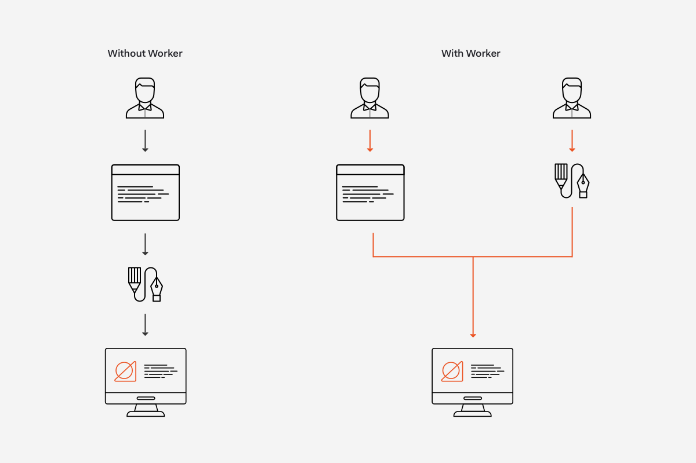
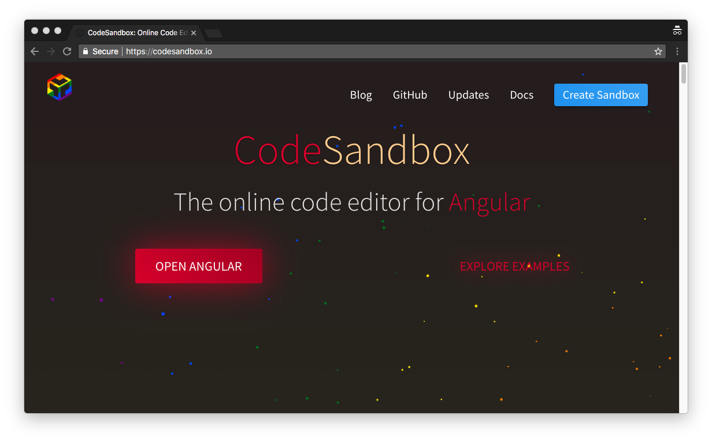
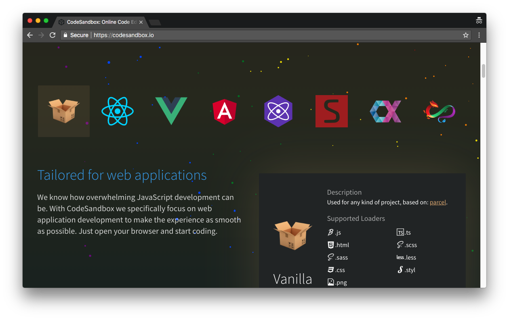
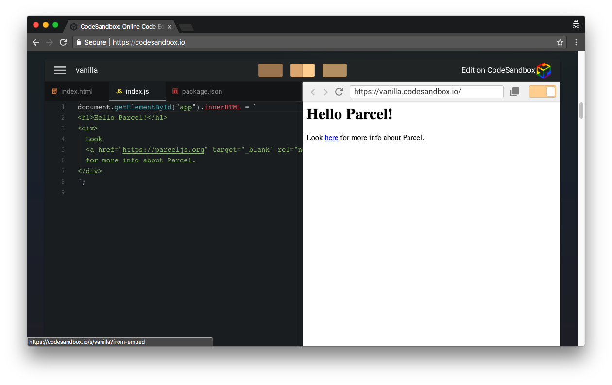
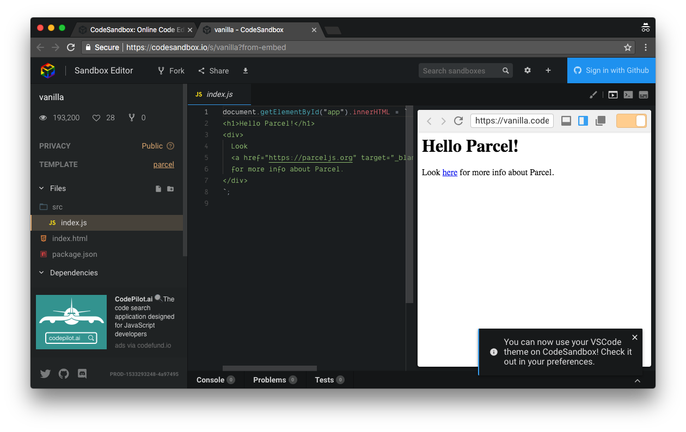
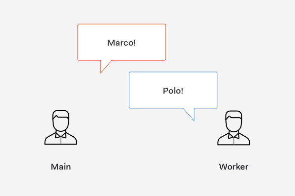

# [译] 快速入门 Web Worker

###### 原文链接：[https://auth0.com/blog/speedy-introduction-to-web-workers/](https://auth0.com/blog/speedy-introduction-to-web-workers/)

> 了解如何在 JavaScript 中使用 Web worker 来创建并行程序并同时执行多个操作，而不是交错。

## 简介 JavaScript 中的 Web Worker

Web workers 使开发者能够从 JavaScript 中的并行编程中获益。并行编程使 JS 可以同时运行不同的计算。让我们来看看 JS 如何像人类一样并行地完成任务，帮助我们理解 web workers 的价值。

假设我们每个人都经营着一个技术博客。我们自己工作，负责编写一个 demo app，写关于这个 app 的开发过程，并且为文章创建静态资源（例如图片，图片，或者 logos），这是一个繁重的管道式的任务。写 app 和写开发过程是相互关联的，因为写代码的经验激发了写开发过程的灵感，但是我们可以将创建静态资源委托给其他人。

比如说，我们有一群有能干的设计师。他们同意为我们创建静态资源。他们所要求的只是我们给他们一个静态资源描述或草图，当他们完成后，他们会给我们很库很专业的版本。现在，一旦他们将资源给我们，我们只需要专注于编码、写作和整合设计师给的静态资源。

这大大提升了我们的生产力。最初，每当我们需要设计静态资源时，就会打断编码和写作。如果我们要单独工作，完成一篇博客帖子所花的时间要比我们委派一个任务给一个设计师朋友要长得多。

设计团队在自己的流水线上异步处理任务。设计团队形象的阐述了 web worker 在 JavaScript 应用程序中的行为。JavaScript 是一种单线程语言。因此，在主线程中运行复杂的逻辑可以阻塞它并使我们的 JavaScript 应用程序看起来缓慢或无响应。使用 web worker，我们可以创建一个单独的线程来运行任何逻辑，而不中断主线程。

> JavaScript 中 的 web worker 允许我们创建并行程序以同时执行多个操作而不是交错

> [交错](https://www.dictionary.com/browse/interleaving)指的是“通过设置例如一组指令等等，以便以交替的方式执行两个或更多个程序”

接下来我们将探讨一下如何在 JavaScript 中使用 web worker 以及它为 web 应用程序带来的好处

## 为什么要使用 JavaScript Web Workers ？

在 JavaScript 中，我们可以创建并行编程来同时使用 web workers 执行多个操作。Web workers 让我们在运行用户界面逻辑的主线程中分离创建后台线程。这种工作量分离的核心优势在于，我们可以在隔离的线程内运行昂贵的操作，而不会中断或影响主线程的响应性和可用性。当后台线程完成其任务时，它通过一个正常的 JavaScript 事件无缝地向主线程通知结果。

> Web worker 是可以像任何其他 JavaScript 对象一样对待：您可以将它们作为函数参数传递，将它们分配给类属性，并且因为它们具有公共接口，甚至可以扩展它们

Web workers 有效地在 JavaScript 中启用了多线程的形式，但存在一些限制，比如不能访问 DOM 以及不能访问 web worker 的父页面（创建它的页面）。考虑到这一点，让我们了解下一步如何创建 web worker。

## 搭建一个开发环境

亲自动手有助于我们更好的理解 web workers！在本文中，我们将在[CodeSandbox](https://codesandbox.io/)项目中运行示例代码，在那里搭建和运行一个原生 JS 项目很容易，请按照以下步骤操作：

- Visit [CodeSandbox](https://codesandbox.io/).

- 在主页面上，单击代表原生 JavaScript 项目的盒子图标。

- 可以在页面中向下滚动并且预览项目。

- 单击 CodeSandbox 上的编辑链接在它自己的浏览器选项卡上打开项目。

- 删除 src 文件夹里的 index.js
- 在 src 目录下创建 main.js 和 worker.js
- 打开 index.html 并将`

        </body>
        </html>

我们很快就会知道为什么要创建这些文件。 CodeSandbox 使用 [ParcelJS](https://parceljs.org/) 可以很的轻松打包 JavaScript 应用程序。

> 随意使用你自己的环境或本地配置！如果你使用的是 Webpack，则需要使用 worker-loader 进行额外配置。我们将在以后的文章中介绍它。

## 创建 Web Workers

要创建 web worker，我们使用[Web Workers API](https://developer.mozilla.org/en-US/docs/Web/API/Web_Workers_API)中的 [Worker()](https://developer.mozilla.org/en-US/docs/Web/API/Worker/Worker) 构造函数。 Worker() 构造函数具有以下性质：

    Worker(aURL, options);

aURL 是一个字符串，表示我们希望 worker 执行的脚本的 URL

options 是一个用来自定义 Worker 实例的对象。[允许的选项](https://developer.mozilla.org/en-US/docs/Web/API/Worker/Worker#Parameters)包括 type，credentials 和 name。在本文中我们不需要去配置它们。

在实际操作中，我们在主线程中实例化一个 web worker，主线程可以用一个 JavaScript 文件来表示，例如这应用程序的入口文件 main.js。web worker 线程可以用另一个文件来表示，例如 workers.js。然后 main.js 通过 worker.js 文件去创建一个 new Worker，让我们来看看具体操作。

首先我们打开 src/main.js 文件，并且写入下列代码：

    // src/main.js

    const worker = new Worker("../src/worker.js");

在上面的代码中，worker 将成为一个 Worker 实例在 worker.js 上执行脚本。

> 在 CodeSandbox 中查找时，我们需要指定 worker.js 的完整路径，以使其正常工作：../src/worker.js。

以上是为了创建一个 web worker！我们现在有效地在应用程序中创建了两个线程：main 和 worker。接下来，我们将学习线程之间如何进行通信。

## Web Worker 收发消息

在导言中，我们讨论了在 Auth0 我们的 Content 和设计团队之间的内部协作如何类似于使用 JavaScript 中的 web workers 的线程之间的交互。在我们的例子中，内容工程师代表主线程，设计师代表 web worker 线程。主线程如何 ping worker 线程，反之亦然？我们通过 Web Workers API 的[postMessage()](https://developer.mozilla.org/en-US/docs/Web/API/Worker/postMessage)方法和[onmessage](https://developer.mozilla.org/en-US/docs/Web/API/Worker/onmessage)事件来实现这一点。

让我们使用经典的[马可波罗游戏](<https://en.wikipedia.org/wiki/Marco_Polo_(game)>)来看看这种沟通的实际效果。在这场比赛中，一名球员大喊“马可！”而其他玩家必须回复“Polo！”。在我们的上下文中，我们希望执行以下操作：

1. main.js 和 worker.js 处于待机状态，侦听彼此之间的任何消息。
2. main.js 向 worker.js 发送消息：“Marco！”
3. worker.js 从 main.js 获取消息并回复：“Polo！”。
4. 无限重复步骤 2 和步骤 3。

### 第 1 步：监听消息

Worker.onmessage 事件处理程序让我们监听线程之间的消息。此 Worker 事件处理程序属性的写法如下：

    myWorker.onmessage = e => {
    // Event handler logic
    };

onmessage 的回调函数在发生 message 事件时被调用。 要在 main.js 中进行设置，使用我们创建的 Worker 实例：

    // src/main.js

    const worker = new Worker("../src/worker.js");

    worker.onmessage = e => {};

要在 worker.js 表示的 web worker 线程中进行设置，我们直接使用 onmessage 属性：

    // src/worker.js

    onmessage = e => {};

我们如何访问正在发送的消息数据？可以从消息事件的 data 属性访问消息有效负载。

让我们照着下面的代码更新我们的代码：

    // src/main.js

    const worker = new Worker("../src/worker.js");

    worker.onmessage = e => {
        const message = e.data;
        console.log([From Worker]: ${message});
    };

    // src/worker.js

    onmessage = e => {
        const message = e.data;
        console.log([From Main]: ${message});
    };

让我们保存每个文件的更改。在 CodeSandbox 上，我们可以使用 CMD + S 或 CTRL + S 来保存每个文件。

### 第 2 步：从主线程向 Worker 线程发送消息

要发送消息，我们依赖于 Worker.postMessage() 方法：

    worker.postMessage(message);

postMessage()获取一个参数用来表示要发送的数据，该数据可以是由[结构化克隆算法](https://developer.mozilla.org/en-US/docs/Web/API/Web_Workers_API/Structured_clone_algorithm)处理的任何值或 JavaScript 对象。如 MDN 所述，结构化克隆算法是由 HTML5 规范定义的用于复制复杂 JavaScript 对象的算法。为什么我们需要依赖这个算法？通过 Web worker 传输的数据作为副本传递，而不是作为参数引用传递。

通过理解 postMessage() 如何工作，让我们使用这个方法从主线程向 worker 线程发送消息：

    // src/main.js

    const worker = new Worker("../src/worker.js");

    worker.onmessage = e => {
        const message = e.data;
        console.log([From Worker]: ${message});
    };

    worker.postMessage("Marco!");

让我们保存我们的更改并在自己的选项卡上打开应用程序预览。这可以通过单击嵌入浏览器导航栏中的“在新窗口中打开”按钮来完成：

在新的预览浏览器选项卡中，我们打开浏览器开发人员控制台并刷新页面，应该看到以下输出：

    // [From Main]: Marco!

控制台中的输出确认了我们的 web worker 正在监听并响应从 main.js 发送的消息事件。现在，我们需要扭转沟通。我们需要从 worker.js 发送一条消息回复给 main.js.

### 第 3 步：从 Worker 线程向主线程发送消息

这很简单。我们需要在 worker.js 中的 onmessage 事件中使用 postMessage()方法：

    // src/worker.js

    onmessage = e => {
        const message = e.data;
        console.log([From Main]: ${message});

        postMessage("Polo!");
    };

保存我们的更改并刷新浏览器。在控制台中，我们现在应该看到以下输出：

    // [From Main]: Marco!
    // [From Worker]: Polo!

我们已经实现了线程之间的双向通信，但是通信是短暂的。让我们让这款多线程马可波罗游戏无限运行。

### 第 4 步：无限地在主线程和 Worker 线程之间发送消息

我们将保持线程之间的沟通无休止地进行。为了更好地来回运行，我们将依赖 [setTimeout()](https://developer.mozilla.org/en-US/docs/Web/API/WindowOrWorkerGlobalScope/setTimeout)将消息传递延迟 3 秒。

首先，当 main.js 从 worker.js 收到消息时，它会在 3 秒后回复：

// src/main.js

    const worker = new Worker("../src/worker.js");

    worker.onmessage = e => {
        const message = e.data;
        console.log([From Worker]: ${message});

    const reply = setTimeout(() => worker.postMessage("Marco!"), 3000);
    };

    worker.postMessage("Marco!");

接下来，当 worker.js 从 main.js 收到消息时，它也会在 3 秒后回复：

    // src/worker.js

    onmessage = e => {
        const message = e.data;
        console.log([From Main]: ${message});

        const reply = setTimeout(() => postMessage("Polo!"), 3000);
    };

3 秒延迟创建了一个对眼睛友好的停顿，以便我们能够在开发者控制台中平静地看到通信。使这无限工作的原因是每个处理的消息事件都执行 postMessage() 响应。之前，main.js 中的 worker.onmessage 在函数内没有回复

让我们保存更改并返回浏览器预览。刷新页面。几秒钟后，将看到以下输出：

    // [From Main]: Marco!
    // [From Worker]: Polo!
    // [From Main]: Marco!
    // [From Worker]: Polo!

这将一直持续到我们关闭正在运行的预览页面。但是，我们也可以手动终止 web worker。让我们看看我们接下来该怎么做。

## 终止 Web Worker

我们可以立即从主线程或 worker 线程终止 web worker。

在主线程中，我们可以通过调用 Web Workers API 的[terminate()](https://developer.mozilla.org/en-US/docs/Web/API/Worker)方法来终止 web worker：

    worker.terminate();

执行 terminate()后，web worker 立即被销毁，没有任何机会完成任何正在进行或等待进行的操作，也没有时间清理。因此，突然终止 web worker 可能导致内存泄漏。

我们还可以从 worker 线程使用自己的 close 方法终止 Web worker：

    close();

在调用 close()时，将丢弃事件循环中存在的任何等待中的任务，并关闭 web worker 作用域。

查看 close()的文档可能会让人感到困惑，因为有一个[版本](https://developer.mozilla.org/en-US/docs/Web/API/WorkerGlobalScope)已弃用 close()方法，这个版本属于 WorkerGlobalScope 接口。实际上，我们可以创建两种类型的 web worker：dedicated 和 shared， 每种类型都有自己专属的接口，分别是[DedicatedWorkerGlobalScope](https://developer.mozilla.org/en-US/docs/Web/API/DedicatedWorkerGlobalScope) 和 [SharedWorkerGlobalScope](https://developer.mozilla.org/en-US/docs/Web/API/SharedWorkerGlobalScope/close)。在本文介绍的范围，我们使用了一个 dedicated web worker。这两种类型的 web worker 之间的区别以及在何处如何使用它们将在未来的帖子中通过终止 workers 的最佳实践中得到解决！

## 概括

我们已经学习了如何创建 web worker 的基础知识。我们学习了如何在两个线程之间有效地发送消息以及如何对这些消息做出反应。我们简要地谈到了终止 web worker 的问题。最后一项任务应谨慎处理，并且需要更详细的解释。终止不当的 web workers 可能会导致应用程序中的内存泄漏。

> 此博客文章中使用的完整代码示例存在于此 [JavaScript CodeSandbox](https://codesandbox.io/s/xp901z23o4) 中。随意 fork 吧。

接下来要学的是什么？很多！ web worker 已经存在了很长时间，他们非常擅长执行繁琐的逻辑。这个逻辑将比我们在这篇博文中所做的要复杂得多。我们需要学习处理错误，产生 subworkers，使用外部库以及使用开发人员工具监控 web worker 等。

请在评论中告诉我你对这篇文章的看法以及你希望了解的有关这种并行编程的便捷技术在 JavaScript 中的其他内容

## 关于 Auth0

Auth0，IDaaS 的全球领导者，为成千上万的企业客户提供用于其 Web，移动，物联网和内部应用程序的通用身份平台。其可扩展平台每月无缝地验证和保护超过 1.5B 的登录，使其受到开发者的喜爱并受到全球企业的信赖。该公司位于华盛顿州贝尔维尤的美国总部以及位于布宜诺斯艾利斯，伦敦，东京和悉尼的其他办事处为位于 70 多个国家的客户提供支持。

有关更多信息，请访问[https://auth0.com](https://auth0.com)或在 Twitter 上关注[@auth0](https://twitter.com/auth0)。
